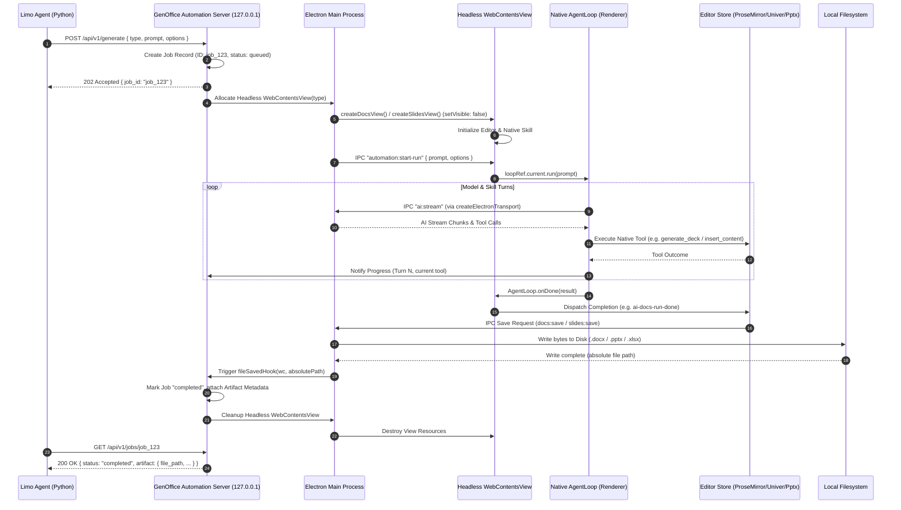

# GenOffice Local Automation Architecture Study
**Connecting Limo's Python Agent to GenOffice Native Agent via Localhost HTTP/JSON-RPC Bridge**

---

## 1. Executive Summary

### The Core Architectural Question
> *"What is the safest and most reliable way for Limo's Python agent to instruct GenOffice's existing native agent to generate a real document without recreating GenOffice's UI or generation logic?"*

### The Verdict
The safest and most reliable approach is an **Electron Main-Process Localhost Automation Bridge** (`127.0.0.1:<port>`) that orchestrates GenOffice's **headless/background `WebContentsView` instances** to execute the existing native `AgentLoop` and native skills, capturing the resulting files via GenOffice's existing **main-process file-saved hooks**.

```
┌─────────────────┐       HTTP / JSON-RPC       ┌────────────────────────────────────────────────────────┐
│   Limo Agent    │ ──────────────────────────> │ GenOffice Electron Main Process                        │
│ (Python/FastAPI)│                             │   ├── Automation HTTP Server (node:http on 127.0.0.1)  │
│                 │ <────────────────────────── │   ├── Job Manager & File Hook Listeners                │
└─────────────────┘      Artifact Metadata      │   └── Headless WebContentsView Pool (hidden views)     │
                                                └──────────────────────────┬─────────────────────────────┘
                                                                           │ IPC dispatch
                                                                           ▼
                                                ┌────────────────────────────────────────────────────────┐
                                                │ Renderer Process (Inside Headless WebContentsView)     │
                                                │   ├── Existing AgentLoop (packages/agent-core/loop.ts) │
                                                │   ├── Native Skills (Docs / Slides / Sheets / PDF)     │
                                                │   ├── In-Memory Editor Model (ProseMirror/Univer/Pptx) │
                                                │   └── Auto-Save IPC -> Real File Saved on Local Disk   │
                                                └────────────────────────────────────────────────────────┘
```

### Why this avoids failure modes:
1. **Zero UI / Macro Automation**: Does not simulate mouse clicks, keystrokes, OS focus, or accessibility events. Completely immune to display scaling, active window switches, screen locking, or UI layout changes.
2. **Zero Duplication of Generation Logic**: Re-uses 100% of GenOffice's multi-step planning, domain-specific skills (`generate_deck`, `propose_operations`, `insert_content`), formatting rules, styling engines, and export pipelines.
3. **No Fake Generators or Post-Processing**: Produces genuine `.docx`, `.pptx`, `.xlsx`, `.pdf`, `.md`, and `.html` files using the exact same code paths that run when a human clicks "Send" inside GenOffice.
4. **Zero Window / Focus Hijacking**: Executes inside a hidden `WebContentsView` (`view.setVisible(false)`), allowing Limo's user to continue working uninterrupted without tabs popping open or stealing desktop focus.

---

## 2. Current GenOffice Architecture (Verified)

GenOffice is structured as an Electron multi-package monorepo using pnpm workspaces.

```
external/GenOffice/
├── apps/
│   ├── shell/      # Main Electron process, multi-tab window, TabManager, global menus
│   ├── docs/       # Word/DOCX editor (ProseMirror / Tiptap)
│   ├── slides/     # PowerPoint/PPTX editor (Canvas / DOM / PptxGenJS / pptx-parser)
│   ├── sheets/     # Excel/XLSX editor (Univer spreadsheet engine + Rust/WASM sidecar)
│   ├── pdf/        # PDF reader/annotator/editor (PDF.js + pdf-lib + headless Chromium)
│   ├── markdown/   # Markdown editor (Monaco/CodeMirror + marked)
│   └── html/       # Standalone HTML editor & previewer
└── packages/
    ├── agent-core/ # Framework-agnostic AgentLoop, tool scheduler, skill composition
    └── html2docx/  # HTML to OpenXML/DOCX conversion engine
```

### 2.1 The Native Agent Engine: `AgentLoop`
The core agent engine is located at:
[`packages/agent-core/src/loop.ts`](file:///c:/Users/Admin/Downloads/LIMO/external/GenOffice/packages/agent-core/src/loop.ts)

* **Class**: `AgentLoop<TSnapshot = unknown>` (lines 200–826).
* **Key Lifecycle Method**: `run(instruction: string, options?: RunOptions): Promise<AgentRunResult>`.
* **Turn Budget**: `DEFAULT_MAX_TURNS = 100` (line 82).
* **Degenerate Loop Guards**: Aborts after `MAX_IDENTICAL_TURNS = 3` identical turns or `MAX_ALL_ERROR_TURNS = 8` error turns (lines 92–93).
* **Event Hooks** (`AgentLoopEvents<TSnapshot>`, lines 32–42):
  * `onText(text: string)`: Emitted on every assistant text chunk.
  * `onToolStart(call: AgentToolCall)`: Emitted before a tool executes.
  * `onToolExecuted(event: ToolExecutedEvent<TSnapshot>)`: Emitted after tool returns, capturing mutations and undo snapshots.
  * `onTurnEnd()`: Signals turn boundary back to the model.
  * `onDone(result: AgentRunResult)`: Signals full completion (`cancelled`, `turnLimit`, `truncated`).
  * `onError(error: string)`: Emitted on unrecoverable model/transport failure.

### 2.2 Skill Architecture
Located at:
[`packages/agent-core/src/skill.ts`](file:///c:/Users/Admin/Downloads/LIMO/external/GenOffice/packages/agent-core/src/skill.ts)

Every document type provides an `AgentSkill`:
```typescript
export interface AgentSkill {
  readonly id: string
  readonly systemPrompt: string
  readonly tools: AgentToolDef[]
  executeTool(call: AgentToolCall, context: ToolExecutionContext): Promise<ToolExecution>
}
```
Skills are combined via `composeSkills('suite', '', [editorSkill, filesSkill])` (line 629 in Docs). When the user sends a prompt, the composed system prompt and tool JSON schemas are delivered to the model. Tool calls emitted by the model are routed back through `skill.executeTool()`.

### 2.3 Model Transport & IPC Channels
GenOffice implements an IPC bridge between the Renderer and Main process for model communication:
* **Renderer Side**: `createElectronTransport()` in each editor (`apps/docs/src/renderer/ai/transport.ts`).
* **Main Process Side**: `registerAiIpc()` in [`apps/docs/src/main/docs-main.ts:2763`](file:///c:/Users/Admin/Downloads/LIMO/external/GenOffice/apps/docs/src/main/docs-main.ts#L2763), registered centrally by the Shell in [`apps/shell/src/main/index.ts:4231`](file:///c:/Users/Admin/Downloads/LIMO/external/GenOffice/apps/shell/src/main/index.ts#L4231).
* **Channels**:
  * `ai:get-settings` / `ai:set-settings`: Reads and persists API keys (Genspark, OpenAI, Anthropic, DeepSeek, Ollama, Codex).
  * `ai:stream`: Streams completions and tool calls via `ai:stream-chunk` events.
  * `ai:stream-cancel`: Aborts active generation.
  * `ai:web-search`: Live Tavily/Genspark search.
  * `ai:image-search`: Returns real photo/illustration URLs.

---

## 3. Real Generation Entry Points (Verified)

Every editor app has a native generation pipeline. The table below lists the verified source locations and mechanics:

| Document Type | Native Generation Tool / Entry Function | Source Location | Execution Context | How File is Persisted |
|---|---|---|---|---|
| **Docs (.docx)** | `createDocsSkill` -> `insert_content` / `replace_blocks` | [`apps/docs/src/renderer/ai/tools.ts:200`](file:///c:/Users/Admin/Downloads/LIMO/external/GenOffice/apps/docs/src/renderer/ai/tools.ts) | Renderer (Tiptap / ProseMirror) | Event `ai-docs-run-done` triggers `save(false, true)` -> `docs:save` IPC |
| **Docs Standalone** | `createAiDocument({ type: 'docx', title, content })` | [`apps/docs/src/main/docs-main.ts:3881`](file:///c:/Users/Admin/Downloads/LIMO/external/GenOffice/apps/docs/src/main/docs-main.ts#L3881) | Main Process + Docs Tab | Dispatches `openAiDocTab` -> `applyAiDocContent` -> auto-save |
| **Slides (.pptx)** | `generate_deck` (self-driving multi-page pipeline) | [`apps/slides/src/renderer/ai/slides-skill.ts:517`](file:///c:/Users/Admin/Downloads/LIMO/external/GenOffice/apps/slides/src/renderer/ai/slides-skill.ts#L517) | Renderer (Slide Store) | Calls `ipcRenderer.invoke('slides:save')` -> [`slides-main.ts:4008`](file:///c:/Users/Admin/Downloads/LIMO/external/GenOffice/apps/slides/src/main/slides-main.ts#L4008) saves PPTX |
| **Sheets (.xlsx)** | `propose_operations` (Workbook DSL batch executor) | [`apps/sheets/src/renderer/ai/tools.ts:490`](file:///c:/Users/Admin/Downloads/LIMO/external/GenOffice/apps/sheets/src/renderer/ai/tools.ts#L490) | Renderer (Univer runtime) | `IPC_CHANNELS.saveWorkbook` in [`sheets-main.ts:2728`](file:///c:/Users/Admin/Downloads/LIMO/external/GenOffice/apps/sheets/src/main/sheets-main.ts#L2728) writes XLSX |
| **PDF (.pdf)** | `create_document` & `printHtmlToPdf` | [`apps/docs/src/main/docs-main.ts:3900`](file:///c:/Users/Admin/Downloads/LIMO/external/GenOffice/apps/docs/src/main/docs-main.ts#L3900) & [`pdf-main.ts:513`](file:///c:/Users/Admin/Downloads/LIMO/external/GenOffice/apps/pdf/src/main/pdf-main.ts#L513) | Main Process (headless `BrowserWindow`) | Direct Chromium PDF print to disk; returns `{ ok: true, path }` |
| **Markdown (.md)** | `createAiDocument({ type: 'md', ... })` | [`apps/docs/src/main/docs-main.ts:3910`](file:///c:/Users/Admin/Downloads/LIMO/external/GenOffice/apps/docs/src/main/docs-main.ts#L3910) | Main Process | `writeFile(path, content, 'utf8')` |
| **HTML (.html)** | `createAiDocument({ type: 'html', ... })` | [`apps/docs/src/main/docs-main.ts:3910`](file:///c:/Users/Admin/Downloads/LIMO/external/GenOffice/apps/docs/src/main/docs-main.ts#L3910) | Main Process | `writeFile(path, content, 'utf8')` |

### In-Depth Mechanics:

#### 1. Docs (.docx) Generation
* In [`apps/docs/src/renderer/ai/AiPanel.tsx:626`](file:///c:/Users/Admin/Downloads/LIMO/external/GenOffice/apps/docs/src/renderer/ai/AiPanel.tsx#L626), the `AgentLoop` executes the `docs` skill.
* When the agent runs tool `insert_content` (or parses an AI outline), it creates ProseMirror document nodes.
* On loop completion (`onDone`, line 711):
  ```typescript
  window.dispatchEvent(new Event('ai-docs-run-done'))
  ```
* In [`apps/docs/src/renderer/App.tsx:3730-3739`](file:///c:/Users/Admin/Downloads/LIMO/external/GenOffice/apps/docs/src/renderer/App.tsx#L3730-L3739), the window listens for this event:
  ```typescript
  useEffect(() => {
    const handler = () => {
      const cur = fileCtxRef.current
      if (!cur.doc || cur.doc.filePath || !anyDirtyRef.current) return
      void save(false, true) // silent first save with auto-generated title
    }
    window.addEventListener('ai-docs-run-done', handler)
    return () => window.removeEventListener('ai-docs-run-done', handler)
  }, [editor, save])
  ```
* `save(false, true)` invokes `ipcRenderer.invoke('docs:save', ...)` which packages the document as `.docx` using `@genoffice/html2docx` and writes it to disk.

#### 2. Slides (.pptx) Generation
* In [`apps/slides/src/renderer/ai/slides-skill.ts:517`](file:///c:/Users/Admin/Downloads/LIMO/external/GenOffice/apps/slides/src/renderer/ai/slides-skill.ts#L517), the tool `generate_deck` is defined:
  `generate_deck({ topic, approx_pages, context, style, pages })`.
* Unlike single-turn completions, `generate_deck` is a **self-driving multi-page pipeline**: it plans the outline, searches for images via Google/Tavily, drafts HTML per slide, converts HTML elements to native PowerPoint shapes/textboxes, and mounts them onto the canvas page by page.
* Once the slides are rendered, the renderer calls `window.desktopApi.save()` -> `ipcMain.handle('slides:save')` in [`apps/slides/src/main/slides-main.ts:4008`](file:///c:/Users/Admin/Downloads/LIMO/external/GenOffice/apps/slides/src/main/slides-main.ts#L4008):
  ```typescript
  if (!session.path) {
    const draftsDir = getDraftsDir()
    session.path = pickDraftPath(draftsDir, tm('untitledDeck'))
  }
  await savePptxToFile(session.opened, session.path)
  slidesOpenedHook?.(e.sender, session.path)
  return { ok: true, path: session.path }
  ```

#### 3. Sheets (.xlsx) Generation
* In [`apps/sheets/src/renderer/ai/tools.ts:490`](file:///c:/Users/Admin/Downloads/LIMO/external/GenOffice/apps/sheets/src/renderer/ai/tools.ts#L490), the tool `propose_operations` accepts a batch of operations (cell values, formulas, formatting, pivot tables, charts).
* The tool applies them directly to the Univer spreadsheet engine via `proposeOperations` ([`App.tsx:1388`](file:///c:/Users/Admin/Downloads/LIMO/external/GenOffice/apps/sheets/src/renderer/App.tsx#L1388)).
* Persisted via `IPC_CHANNELS.saveWorkbook` in [`apps/sheets/src/main/sheets-main.ts:2728`](file:///c:/Users/Admin/Downloads/LIMO/external/GenOffice/apps/sheets/src/main/sheets-main.ts#L2728), which writes the `.xlsx` file and triggers `workbookOpenedHook?.(event.sender, targetPath)`.

#### 4. PDF Generation
* In [`apps/docs/src/main/docs-main.ts:3900`](file:///c:/Users/Admin/Downloads/LIMO/external/GenOffice/apps/docs/src/main/docs-main.ts#L3900) & [`apps/pdf/src/main/pdf-main.ts:513`](file:///c:/Users/Admin/Downloads/LIMO/external/GenOffice/apps/pdf/src/main/pdf-main.ts#L513):
  ```typescript
  const bytes = await printHtmlToPdf(
    buildPrintableHtml(title, content),
    () => new BrowserWindow({ show: false, webPreferences: { sandbox: true, javascript: false } })
  )
  const filePath = uniquePathIn(defaultSaveDir(), `${title}.pdf`)
  await writeFile(filePath, bytes)
  return { ok: true, path: filePath }
  ```
* This runs completely headless inside an invisible `BrowserWindow` without any UI overhead.

---

## 4. IPC & Main-Process Architecture (Verified)

### 4.1 Tab and View Management: `TabManager`
Located at:
[`apps/shell/src/main/tab-manager.ts`](file:///c:/Users/Admin/Downloads/LIMO/external/GenOffice/apps/shell/src/main/tab-manager.ts)

* `TabManager` manages all tabs within the single Shell window.
* Each document tab is an Electron `WebContentsView` attached as a child view:
  ```typescript
  // tab-manager.ts:171-172
  this.shellWindow.contentView.addChildView(view)
  view.setVisible(false) // Non-active tabs are hidden!
  ```
* **Critical Finding**: A `WebContentsView` can execute full renderer code, run React, load models, execute `AgentLoop`, and perform file I/O **while `setVisible(false)`**. Only `activateTab(id)` toggles visibility to `true`.

### 4.2 Existing File-Saved Hooks in Main Process
In [`apps/shell/src/main/index.ts:2414-2457`](file:///c:/Users/Admin/Downloads/LIMO/external/GenOffice/apps/shell/src/main/index.ts#L2414-L2457), the Shell connects file-save hooks to synchronize recent files, update tab titles, and track active documents:

```typescript
setDocsFileSavedHook((wc, path) => {
  manager.setTabFileFor(wc.id, path)
  recordRecentFile(path)
  applyPendingProject(path)
})

setSlidesOpenedHook((wc, path) => {
  manager.setTabFileFor(wc.id, path)
  recordRecentFile(path)
})

setSheetsWorkbookOpenedHook((wc, path) => {
  manager.setTabFileFor(wc.id, path)
  recordRecentFile(path)
})

setMarkdownFileSavedHook((wc, path) => { ... })
setHtmlFileSavedHook((wc, path) => { ... })
setPdfRenamedHook((wc, oldPath, newPath) => { ... })
```
**Significance for Automation**: When GenOffice saves an AI-generated file, the Main Process **already knows the exact absolute file path immediately**. We do not have to guess or scan the disk.

### 4.3 Existing Precedent for Localhost HTTP Server in GenOffice
In [`apps/sheets/src/main/sheets-main.ts:1810-1845`](file:///c:/Users/Admin/Downloads/LIMO/external/GenOffice/apps/sheets/src/main/sheets-main.ts#L1810-L1845), GenOffice **already contains a localhost HTTP server** built with Node's standard `node:http`:
```typescript
import { createServer } from 'node:http'

function startCaptureServer(): void {
  if (!debugPort) return
  const server = createServer((request, response) => {
    const url = new URL(request.url ?? '/', 'http://127.0.0.1')
    if (url.pathname === '/open') { ... }
    if (url.pathname === '/menu') { ... }
    if (url.pathname === '/capture') { ... }
  })
  server.listen(debugPort, '127.0.0.1')
}
```
This proves that a local `node:http` server inside Electron Main is the idiomatic, zero-dependency architectural choice already recognized in the repository.

---

## 5. The Automation Boundary

We evaluated four possible architectural boundaries to determine where Limo should interface with GenOffice:

```
Option A: OS / CDP GUI Automation (Mouse/Keystroke injection into Renderer)
   ❌ Flaky, steals OS mouse/focus, breaks if user minimizes or switches window.

Option B: Headless Python Re-implementation (Extracting GenOffice logic into Python)
   ❌ Disastrous: Must rewrite ProseMirror, Univer, PPTX render trees, 50+ tools in Python.

Option C: Direct Renderer DevTools / WebSocket Script Injection
   ❌ Fragile: Relies on undocumented DOM selectors, breaks on React state updates.

Option D: Localhost HTTP/JSON-RPC Server in Electron Main Process (RECOMMENDED)
   ✅ 100% Reliable: Zero UI dependencies, headless WebContentsView, direct hook interception.
```

### Why Option D is the Optimal Automation Boundary:
1. **Separation of Concerns**: Limo (Python) sends high-level document intents (`type`, `prompt`, `options`) and receives structured artifact metadata (`job_id`, `status`, `file_path`, `mime_type`).
2. **Process Integrity**: Electron Main is the orchestrator of all resources, IPC channels, and lifecycle events. It can spawn an invisible `WebContentsView`, load the appropriate document bundle, trigger the renderer's `AgentLoop`, track execution, and capture the saved file path without touching any UI.
3. **Clean Teardown**: Once the document is saved and metadata returned, the Main Process simply cleans up the invisible `WebContentsView`.

---

## 6. Proposed Localhost JSON-RPC/HTTP Interface

The automation server will run as a lightweight module in GenOffice Main:
[`apps/shell/src/main/automation-server.ts`](file:///c:/Users/Admin/Downloads/LIMO/external/GenOffice/apps/shell/src/main/)
It listens on `127.0.0.1:48123` (or an ephemeral port stored in a runtime config file).

### 6.1 Endpoints Overview

| Method | Endpoint | Description |
|---|---|---|
| `POST` | `/api/v1/generate` | Enqueue a new asynchronous document generation job |
| `GET` | `/api/v1/jobs/{job_id}` | Poll generation progress, status, and artifact metadata |
| `POST` | `/api/v1/jobs/{job_id}/cancel` | Abort an active generation run |
| `GET` | `/api/v1/artifacts/{artifact_id}` | Retrieve artifact details and absolute filesystem path |
| `GET` | `/api/v1/health` | Healthcheck and active capabilities list |

### 6.2 Request / Response Schemas

#### 1. Enqueue Generation: `POST /api/v1/generate`
**Request Payload**:
```json
{
  "type": "presentation",
  "prompt": "Create an 8-slide executive pitch deck for a series-A AI enterprise startup called CyberShield.",
  "project_id": "proj_8f92a1",
  "session_id": "sess_004c2",
  "options": {
    "title": "CyberShield Series A Pitch",
    "approx_pages": 8,
    "background": true,
    "save_directory": "C:\\Users\\Admin\\Downloads\\LIMO\\workspace\\artifacts"
  }
}
```
*Valid `type` values*: `"document"` (`docx`), `"presentation"` (`pptx`), `"spreadsheet"` (`xlsx`), `"pdf"`, `"markdown"`, `"html"`.

**Response (HTTP 202 Accepted)**:
```json
{
  "ok": true,
  "job_id": "job_e72b019a",
  "status": "queued",
  "created_at": "2026-09-11T17:50:00.123Z",
  "poll_url": "/api/v1/jobs/job_e72b019a"
}
```

#### 2. Poll Status: `GET /api/v1/jobs/{job_id}`
**Response While Running (HTTP 200 OK)**:
```json
{
  "ok": true,
  "job_id": "job_e72b019a",
  "status": "generating",
  "created_at": "2026-09-11T17:50:00.123Z",
  "progress": {
    "current_turn": 3,
    "max_turns": 25,
    "last_tool": "generate_deck",
    "message": "Generating slide 4 of 8: Market Architecture"
  },
  "artifact": null,
  "error": null
}
```

**Response On Completion (HTTP 200 OK)**:
```json
{
  "ok": true,
  "job_id": "job_e72b019a",
  "status": "completed",
  "created_at": "2026-09-11T17:50:00.123Z",
  "completed_at": "2026-09-11T17:50:34.892Z",
  "progress": {
    "current_turn": 4,
    "max_turns": 25,
    "last_tool": "slides:save",
    "message": "Document successfully generated and saved to disk."
  },
  "artifact": {
    "artifact_id": "art_99182a",
    "type": "presentation",
    "format": "pptx",
    "file_name": "CyberShield Series A Pitch.pptx",
    "file_path": "C:\\Users\\Admin\\Downloads\\LIMO\\workspace\\artifacts\\CyberShield Series A Pitch.pptx",
    "size_bytes": 1492048,
    "sha256": "4b72c918a3...391a",
    "metadata": {
      "pages": 8,
      "topic": "CyberShield Series A Pitch"
    }
  },
  "error": null
}
```

#### 3. Error Case (HTTP 200 OK with `status: "failed"`)
```json
{
  "ok": false,
  "job_id": "job_e72b019a",
  "status": "failed",
  "created_at": "2026-09-11T17:50:00.123Z",
  "completed_at": "2026-09-11T17:50:12.441Z",
  "progress": null,
  "artifact": null,
  "error": {
    "code": "PROVIDER_TIMEOUT",
    "message": "Model stream timed out after 60 seconds without response."
  }
}
```

---

## 7. End-to-End Sequence Diagram



---

## 8. Background Execution Strategy

A primary requirement is that document generation must **never force the user to leave Limo** or interfere with their desktop activity.

### 8.1 Headless `WebContentsView` Isolation
In Electron 30+, `WebContentsView` is decoupled from window chrome:
1. When a job arrives, Main calls the view factory corresponding to the document type:
   * `createDocsView(undefined)` in [`apps/shell/src/main/tab-manager.ts:167`](file:///c:/Users/Admin/Downloads/LIMO/external/GenOffice/apps/shell/src/main/tab-manager.ts#L167)
   * `createSlidesView(undefined)` in [`apps/shell/src/main/tab-manager.ts:208`](file:///c:/Users/Admin/Downloads/LIMO/external/GenOffice/apps/shell/src/main/tab-manager.ts#L208)
   * `createSheetsView({ includeAiHandlers: false })` in [`apps/shell/src/main/tab-manager.ts:187`](file:///c:/Users/Admin/Downloads/LIMO/external/GenOffice/apps/shell/src/main/tab-manager.ts#L187)
2. The view is added to `shellWindow.contentView.addChildView(view)`, but **never** activated in `TabManager`.
3. `view.setVisible(false)` is maintained throughout the entire generation.
4. `shellWindow` is **not** focused or brought to front (`win.showInactive()` or purely off-screen bounds).

### 8.2 CPU & Throttling Guards
By default, Chromium throttles background `requestAnimationFrame` and timers in hidden views.
To ensure full-speed generation in the background:
```typescript
const view = new WebContentsView({
  webPreferences: {
    backgroundThrottling: false, // Prevents timer delays in background agent loops
    preload: PRELOAD_PATH,
    contextIsolation: true,
    sandbox: false,
  }
})
```

---

## 9. Completion Detection & Error Handling

### 9.1 Verified Completion Signals

| Stage | Exact Signal / Event | Location in GenOffice Codebase |
|---|---|---|
| **Loop Finished** | `AgentLoopEvents.onDone(result)` | [`packages/agent-core/src/loop.ts:40`](file:///c:/Users/Admin/Downloads/LIMO/external/GenOffice/packages/agent-core/src/loop.ts#L40) |
| **Docs Auto-Save** | `window.dispatchEvent(new Event('ai-docs-run-done'))` | [`apps/docs/src/renderer/ai/AiPanel.tsx:711`](file:///c:/Users/Admin/Downloads/LIMO/external/GenOffice/apps/docs/src/renderer/ai/AiPanel.tsx#L711) |
| **Docs File Saved** | `setDocsFileSavedHook((wc, path) => ...)` | [`apps/shell/src/main/index.ts:2427`](file:///c:/Users/Admin/Downloads/LIMO/external/GenOffice/apps/shell/src/main/index.ts#L2427) |
| **Slides File Saved** | `slidesOpenedHook?.(e.sender, session.path)` | [`apps/slides/src/main/slides-main.ts:4017`](file:///c:/Users/Admin/Downloads/LIMO/external/GenOffice/apps/slides/src/main/slides-main.ts#L4017) |
| **Sheets File Saved** | `workbookOpenedHook?.(event.sender, targetPath)` | [`apps/sheets/src/main/sheets-main.ts:2850`](file:///c:/Users/Admin/Downloads/LIMO/external/GenOffice/apps/sheets/src/main/sheets-main.ts#L2850) |
| **PDF Direct Creation** | `createAiDocument` returns `{ ok: true, path }` | [`apps/docs/src/main/docs-main.ts:3908`](file:///c:/Users/Admin/Downloads/LIMO/external/GenOffice/apps/docs/src/main/docs-main.ts#L3908) |

### 9.2 Error Detection & Recovery
* **Renderer Crash**: Listen to `webContents.on('render-process-gone', (e, details) => ...)` to immediately mark the job `failed` with reason `details.reason`.
* **Agent Errors**: Captured by `AgentLoopEvents.onError(err)` in [`packages/agent-core/src/loop.ts:41`](file:///c:/Users/Admin/Downloads/LIMO/external/GenOffice/packages/agent-core/src/loop.ts#L41).
* **AI Provider Errors**: Caught at the IPC boundary (`ai:stream` errors such as invalid API key or model rate limits).
* **Save Failure**: `docs:save` or `slides:save` returning `{ ok: false, error }`.

---

## 10. Reliability, Concurrency & Lifecycle

1. **Job Timeouts**:
   * Docs / Sheets / Markdown / PDF: 120 seconds.
   * Slides (multi-page image search & generation): 300 seconds.
   * On timeout expiration, an abort signal is sent via `ai:stream-cancel` and the view is torn down.
2. **Concurrency Management**:
   * Cap background generation jobs to **2 concurrent views** to prevent RAM spikes (each Chromium renderer takes ~120MB–250MB). Additional incoming requests are queued in memory.
3. **Graceful Teardown**:
   * Once a job reaches `completed` or `failed`, its `WebContentsView` is detached and cleaned up.
   * Note on Docs Teardown: GenOffice developers documented in [`apps/shell/src/main/tab-manager.ts:468`](file:///c:/Users/Admin/Downloads/LIMO/external/GenOffice/apps/shell/src/main/tab-manager.ts#L468) that calling `webContents.close()` synchronously on Docs can cause an upstream Electron modal freeze; GenOffice's helper `teardownDocsRenderer(wc)` must be used for safe teardown.

---

## 11. Security Considerations

1. **Strict Localhost Binding**:
   * The HTTP server binds exclusively to `127.0.0.1` (never `0.0.0.0` or public interfaces).
2. **Authentication Token**:
   * When GenOffice starts the automation server, it generates an ephemeral cryptographically random bearer token written to a local file (e.g. `~/.genoffice/automation.token` with OS user-only read permissions `0600`).
   * Limo reads this token on startup and passes it in the `Authorization: Bearer <token>` header.
3. **Whitelisted Actions**:
   * The API exclusively exposes document generation and status endpoints.
   * **No arbitrary shell execution**: Rejects any request attempting to execute shell commands or system binaries.
   * **No arbitrary filesystem read**: Only reads/writes files within the user's default save folder or explicitly whitelisted project workspaces.
   * Path sanitization via `sanitizeAiDocFileBase` ([`docs-main.ts:3885`](file:///c:/Users/Admin/Downloads/LIMO/external/GenOffice/apps/docs/src/main/docs-main.ts#L3885)) strips path traversal characters (`..`, `/`, `\`).

---

## 12. Files & Functions Integration Matrix

The table below lists every GenOffice source file and symbol that will be connected to the proposed automation bridge:

| Component | Target File | Class / Function / Hook | Role in Local Automation |
|---|---|---|---|
| **Automation Server** | `apps/shell/src/main/automation-server.ts` | `startAutomationServer()` *(NEW)* | Hosts HTTP API, maps jobs to hidden views, delivers artifact paths |
| **Shell Main** | [`apps/shell/src/main/index.ts`](file:///c:/Users/Admin/Downloads/LIMO/external/GenOffice/apps/shell/src/main/index.ts) | `app.whenReady()` (line 4240) | Initializes `startAutomationServer()`, attaches file hooks |
| **Tab Manager** | [`apps/shell/src/main/tab-manager.ts`](file:///c:/Users/Admin/Downloads/LIMO/external/GenOffice/apps/shell/src/main/tab-manager.ts) | `createDocsView`, `createSlidesView`, etc. | Spawns background views without calling `activateTab` |
| **Agent Core** | [`packages/agent-core/src/loop.ts`](file:///c:/Users/Admin/Downloads/LIMO/external/GenOffice/packages/agent-core/src/loop.ts) | `AgentLoop.run()` (line 200) | Core execution engine driving LLM turns and tool calls |
| **Docs Main** | [`apps/docs/src/main/docs-main.ts`](file:///c:/Users/Admin/Downloads/LIMO/external/GenOffice/apps/docs/src/main/docs-main.ts) | `createAiDocument()` (line 3881), `setDocsFileSavedHook` | Direct PDF/DOCX/MD creation and `.docx` save interception |
| **Docs Renderer** | [`apps/docs/src/renderer/ai/AiPanel.tsx`](file:///c:/Users/Admin/Downloads/LIMO/external/GenOffice/apps/docs/src/renderer/ai/AiPanel.tsx) | `onDone` (line 692), `ai-docs-run-done` (line 711) | Detects completion and triggers automatic background save |
| **Slides Skill** | [`apps/slides/src/renderer/ai/slides-skill.ts`](file:///c:/Users/Admin/Downloads/LIMO/external/GenOffice/apps/slides/src/renderer/ai/slides-skill.ts) | `generate_deck` (line 517) | Multi-page planning, image retrieval, and slide generation |
| **Slides Main** | [`apps/slides/src/main/slides-main.ts`](file:///c:/Users/Admin/Downloads/LIMO/external/GenOffice/apps/slides/src/main/slides-main.ts) | `slides:save` (line 4008), `slidesOpenedHook` | Saves PPTX to disk and notifies Main process with absolute path |
| **Sheets Main** | [`apps/sheets/src/main/sheets-main.ts`](file:///c:/Users/Admin/Downloads/LIMO/external/GenOffice/apps/sheets/src/main/sheets-main.ts) | `IPC_CHANNELS.saveWorkbook` (line 2728), `workbookOpenedHook` | Saves XLSX to disk and notifies Main process with absolute path |
| **PDF Main** | [`apps/pdf/src/main/pdf-main.ts`](file:///c:/Users/Admin/Downloads/LIMO/external/GenOffice/apps/pdf/src/main/pdf-main.ts) | `createStandaloneDocument` (line 501) | Headless Chromium PDF print and direct save |

---

## 13. Recommended Implementation Order

When approval to implement is granted, the work should proceed in three distinct phases:

### Phase 1: Main-Process Automation Server (`GenOffice`)
1. Create `apps/shell/src/main/automation-server.ts` using standard `node:http`.
2. Implement job registry (`Map<string, JobRecord>`) and routes (`POST /generate`, `GET /jobs/:id`).
3. Connect `setDocsFileSavedHook`, `setSlidesOpenedHook`, and `setSheetsWorkbookOpenedHook` to resolve active jobs with real saved paths.

### Phase 2: Background Runner IPC (`GenOffice`)
1. Add an IPC channel `automation:execute-run` in preload/renderers to allow Main to invoke `loopRef.current.run(prompt)` directly on a hidden view.
2. Ensure views created with `background: true` do not steal window focus or alter the visible tab bar.
3. Test end-to-end generation of a 5-slide deck and a 3-page document in background mode.

### Phase 3: Limo Python Client (`Limo`)
1. Create `limo/integrations/genoffice_client.py` using `httpx`.
2. Wrap GenOffice capabilities as Limo agent tools (`generate_document`, `generate_presentation`, `generate_spreadsheet`).
3. Return verified file paths and artifact previews to Limo's chat and workspace store.
