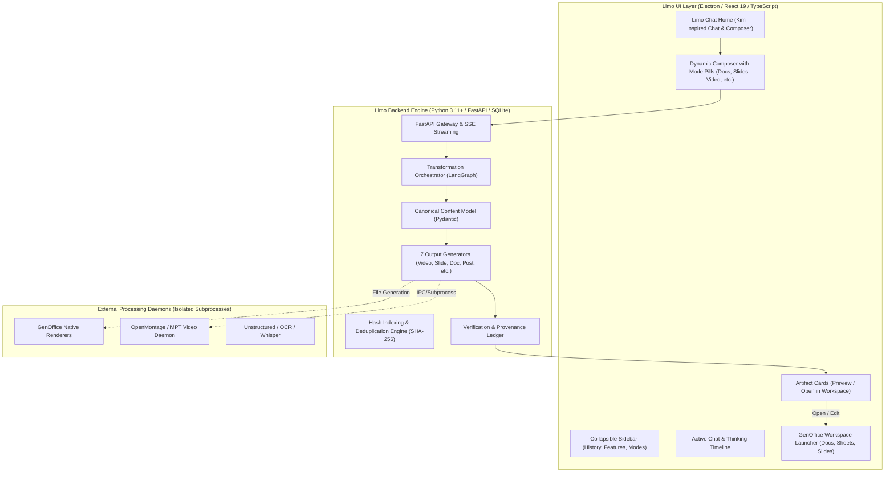

# Limo: Master Architectural & Implementation Plan

> **Platform Codename**: Limo  
> **Core Purpose**: AI-Native Conversational Workspace & Multi-Format Content Transformation Engine  
> **Reference UI**: Kimi.ai conversational interface paired with GenOffice office suite & open-source media engines  
> **Strict Policy**: Independent clean-room implementation. No proprietary code copied; no mention of external organization or reference codenames in UI/branding. No emoji characters used as interface icons.

---

## 1. Project Goal & Problem Requirements

### 1.1 Project Goal
Limo is an enterprise-grade AI content transformation platform and generative conversational workspace. It empowers users to input complex information—research reports, policy documents, news articles, video/audio transcripts, data tables, and high-level prompts—and convert them into high-impact communication artefacts with complete provenance, citation accuracy, and custom stylistic controls.

### 1.2 Core Problem Requirements
According to the foundational problem specification:
1. **Universal Multi-Modal Ingestion**: Accept Text, PDF, DOCX, Spreadsheets, Articles, Images, Audio, and Video files.
2. **Context & Intent Understanding**: Deeply extract entities, facts, chronology, themes, and objectives into a structured **Canonical Content Model**.
3. **Configurable Transformation Parameters**:
   - **Target Audience**: (e.g., Executive, Technical, Public, Policy Makers)
   - **Tone**: (e.g., Authoritative, Objective, Urgent, Engaging)
   - **Language**: (Multi-language synthesis and translation)
   - **Level of Detail**: (Concise, Detailed, Analytical, Comprehensive)
   - **Communication Objective**: (Inform, Persuade, Alert, Educate)
   - **Content Style**: (Corporate, Journalistic, Academic, Social-first)
4. **Seven Required Output Artefacts**:
   - **1. Video**: Script, storyboard, visual descriptions, TTS narration, subtitles, and rendered MP4 video.
   - **2. LinkedIn Post**: Professional long-form post with headline, key takeaways, and engagement hooks.
   - **3. Twitter/X Post / Thread**: Platform-optimized concise post or multi-tweet thread.
   - **4. Advisory / Intelligence Briefing**: Structured formal document (DOCX/PDF) with threat levels, recommendations, and executive summaries.
   - **5. Infographic Plan & Layout**: Key messaging, visual hierarchy, statistics, layout schema (SVG/HTML preview).
   - **6. Executive Summary**: High-density brief highlighting key conclusions, risks, and next steps.
   - **7. Presentation**: Structured multi-slide deck with speaker notes and downloadable `.pptx`.
5. **Output Validation & Source-to-Output Traceability**:
   - Fact-checking, citation verification, and hallucination reduction.
   - Cryptographic hashing (SHA-256) of input sources and output artefacts for tamper-evident provenance.
6. **Dual Workspace Architecture**:
   - **Limo Conversational Home**: Kimi-style chat-first AI interface with dynamic feature pills (Docs, Slides, Sheets, Deep Research, Video, Advisory, Social).
   - **GenOffice Workspace**: File/document-centric suite preserving full editing capabilities for DOCX, PPTX, XLSX, PDF, and Markdown.

---

## 2. Component Audits & Roles

| Component | Source / Remote | License | Role in Limo | Architectural Isolation & Boundaries |
| :--- | :--- | :--- | :--- | :--- |
| **GenOffice** | `github.com/genspark-ai/genoffice` | Apache-2.0 | Office Document Editors (Docs, Sheets, Slides, PDF, Markdown) | Preserved in `external/GenOffice`. Connected via file artifacts (`.docx`, `.pptx`, `.xlsx`, `.pdf`) and navigation toggle. GenOffice home remains distinct and unmodified. |
| **OpenMontage** | `github.com/calesthio/OpenMontage` | AGPLv3 | Agentic Video Timeline & Remotion Composer | Preserved in `external/OpenMontage`. Due to AGPLv3 copyleft terms, kept completely decoupled across IPC/REST boundaries as a standalone rendering daemon. |
| **MoneyPrinterTurbo** | `github.com/harry0703/MoneyPrinterTurbo` | MIT | Automated Short Video Generator (TTS, footage search, FFmpeg) | Preserved in `external/MoneyPrinterTurbo`. Provides fast template-based video generation CLI/API fallback. |
| **Claude Code** | `github.com/anthropics/claude-code` | Proprietary (All Rights Reserved) | Architectural & Agent-Harness Reference | Study only. Zero proprietary source code, scripts, or assets are copied into Limo. Informs tool-calling patterns and loop ergonomics. |

---

## 3. System Architecture & Boundaries

---

## 4. UI Reference Analysis (Kimi.ai Design Tokens)

From direct DOM and visual analysis of the reference platform:

### 4.1 Color Tokens
- **Background (App Canvas)**: `#181817` (`rgb(24, 24, 23)`)
- **Composer / Card Elevated Surface**: `#1F1F1F` (`rgb(31, 31, 31)`)
- **Sidebar Surface**: `#141413` (`rgb(20, 20, 19)`)
- **Primary Text**: `#D6D6D6` (`rgba(255, 255, 255, 0.84)`)
- **Secondary / Subdued Text**: `#8E8E8E` (`rgba(255, 255, 255, 0.56)`)
- **Placeholder Text**: `#616161` (`rgba(255, 255, 255, 0.38)`)
- **Subtle Borders**: `1px solid rgba(255, 255, 255, 0.12)`
- **Selected Pill / Highlight**: `rgba(255, 255, 255, 0.12)` with solid white text
- **Send Button (Enabled)**: Solid white `#FFFFFF` circle with dark icon `#181817`
- **Send Button (Disabled)**: `rgba(255, 255, 255, 0.15)` with faint icon

### 4.2 Geometry & Typography
- **Font Stack**: `-apple-system, BlinkMacSystemFont, "Segoe UI", Roboto, "Helvetica Neue", sans-serif`
- **Sidebar Width**: Expanded `240px` / Collapsed `64px`
- **Composer Max Width**: `768px` centered
- **Composer Radius**: `24px`
- **Card / Artifact Radius**: `16px`
- **Pill Radius**: `20px` (height `36px`)
- **Icons**: Clean geometric SVG icons (Lucide icon set), strictly zero emoji icons.

### 4.3 Feature Interaction Model
- Clicking a mode (Docs, Slides, Sheets, Deep Research, Video, Advisory) updates the active route.
- A removable feature pill appears inside the composer controls row.
- Composer placeholder dynamically switches to reflect the chosen output.
- Mode-specific quick-start inspiration cards render below the composer.
- Clicking the pill's remove `×` button clears the mode and returns the composer to standard conversational chat.

---

## 5. Development Phases

- **D1 — Project Foundation**: `COMPLETED` (Environment, repositories, external engine checkouts, configs).
- **D2 — Frontend Refinement**: `COMPLETED` (Kimi-inspired UI, composer, mode pills, thinking timeline, artifact cards, GenOffice workspace switch).
- **D3 — Backend Core**: `COMPLETED` (FastAPI, SQLite schema, repositories, atomic storage, projects, sessions, sources).
- **D4 — Agent Infrastructure**: `COMPLETED` (ReAct agent loop, tool execution, provider adapters, session persistence).
- **D5 — Content Ingestion & Understanding**: `COMPLETED` (Heterogeneous extractors, Normalization, Gemini understanding, Canonical Content Model).
- **D6 — Core Transformation & Generation**: `COMPLETED & FROZEN` (D6.1-D6.6 complete, 288/288 tests passing, native adapters, staged contracts, single execution path, Ponytail audit cleanup).
- **D7 — GenOffice Integration**: `NEXT` (Local Electron automation bridge, IPC/HTTP endpoints, native Docs/Slides/Sheets generation).
- **D8 — Video Engine Integration**: `PLANNED` (OpenMontage + MoneyPrinterTurbo pipeline).
- **D9 to D14 — Hardening, Observability & Production**: `PLANNED` (Durable event replay, multi-session state, distribution).

---

## 6. Implementation Status & Next Steps

1. **Phase D6 Frozen**: All transformation planning, engine routing, native generation, workflow orchestration, lifecycle handoff, and real verification are 100% verified and frozen.
2. **Next Immediate Step**: Initiate **Phase D7 — GenOffice Local Automation Integration** by building the localhost HTTP/IPC bridge to GenOffice's Electron Main Process to consume the staged `GenOfficePayload` contracts.
